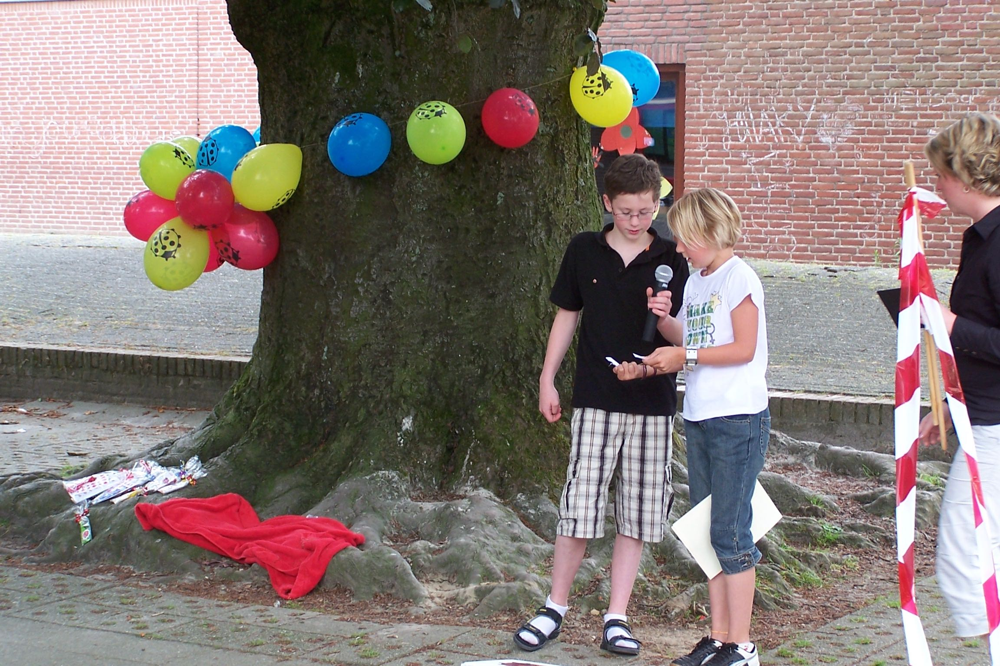

I was thinking the other day about the fact that I haven’t really fought for a cause since I was in primary school. 

Back then, when I was around 11, I started an ‘anti-bullying club’ with some classmates and wrote an anti-bullying song. We recorded it with all of my fifth-grade classmates on a sunny summer's day in my dad’s garage. 

A month or so later, I co-organised an anti-bullying day with my schools headmaster, which consisted of a market, games, watching a documentary, singing the song we had written, and the most awkward speech given by a mini version of yours truly in front of the whole school.

 

I felt bad about not doing more this week. I don’t want to be one of those people that posts a black square on Instagram and calls it a day. This topic is way too interesting and enraging for that.

I’ve also noticed that this topic makes me feel depressed and say things in the lines of “sad that this is still a problem in 2020“. I think that feeling is coming from the right place, but not at all a productive approach.

What I should be doing at the moment is educating myself, reading and listening. The historic context behind this movement is not only very important, but also fascinating, and unfortunately not taught at all in Dutch schools.

Some interesting reading material I’ve come across so far:

* **[Letter From a Region in My Mind](https://www.newyorker.com/magazine/1962/11/17/letter-from-a-region-in-my-mind)** - one of the many insightful essays by James Baldwin.
* **[When Feminism is White Supremacy in Heels](https://www.harpersbazaar.com/culture/politics/a22717725/what-is-toxic-white-feminism/)** – a friend of mine pointed out that feminism isn’t necessarily intersectional.
* **[The Validity of Violence](https://timeline.com/by-the-end-of-his-life-martin-luther-king-realized-the-validity-of-violence-4de177a8c87b)** - “Nonviolence — as it is discussed and fetishized in proximity to the poor and/or marginalized — is so often only dragged out in response to any uprising of those people.”

